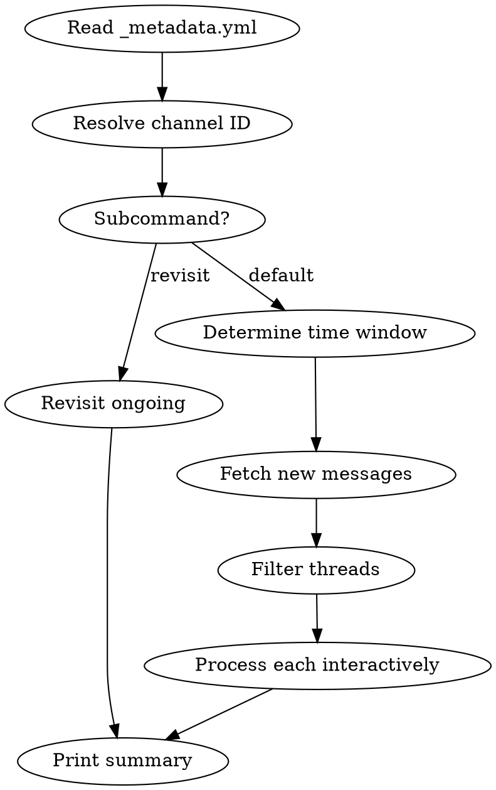

# Internal Channel Learnings

Extract learnings from `#fes-platform-internal` Slack threads into structured, date-grouped Obsidian markdown files. Classifies threads into categories (decision, incident, knowledge, process-change, discussion) and uses category-specific templates with a shared base.

## When to Use

- User wants to process internal channel threads into knowledge base notes
- User wants to check on previously ongoing threads
- User wants to review what came through the internal channel recently

## Arguments

- **No arguments:** Process new threads since last run (or 24h if first run).
- **`revisit`:** Revisit all ongoing threads in metadata. Does NOT process new threads.
- **Time window:** `3d`, `1w`, `12h` — override the lookback window
- **`--channel #name`:** Override the default channel (default: `#fes-platform-internal`)

Parse the argument string. Time windows use format `<N><unit>` where unit is `h` (hours), `d` (days), `w` (weeks), or `m` (months). Convert to a Unix timestamp for the Slack API `oldest` parameter.

## Output Directory

All files go to `~/Documents/Work/raw/internal_learnings/`.

## Categories

Each thread is classified into one of five categories. The shared base appears on all entries; category-specific sections follow.

| Category | When to Use | Status Values |
|----------|-------------|---------------|
| **decision** | A choice was made among alternatives | resolved, ongoing |
| **incident** | Something broke or degraded | resolved, ongoing |
| **knowledge** | Someone shared useful information | informational |
| **process-change** | A workflow or process was changed | informational, ongoing |
| **discussion** | General discussion with notable points | resolved, ongoing, informational |

## Workflow

Two modes: **default** (process new threads) and **revisit** (check ongoing threads).



### Phase 1: Setup

1. **Read metadata:** Read `~/Documents/Work/raw/internal_learnings/_metadata.yml`. If it doesn't exist, initialize an empty structure:

   ```yaml
   channel_defaults: {}
   threads: []
   ```

2. **Resolve channel:** Check `channel_defaults` in metadata for cached channel name -> ID mapping. If not cached, use `mcp__claude_ai_Slack__slack_search_channels` to look up the channel ID, then cache it in metadata.

3. **Route by subcommand:**
   - If argument is `revisit`: go to **Revisit Ongoing** mode
   - Otherwise: go to **Process New Threads** mode

4. **Determine time window** (Process New Threads mode only):
   - If explicit argument (e.g., `3d`): calculate Unix timestamp = now minus duration
   - If no argument: find the most recent `date_processed` across all threads in metadata, use start of that day as `oldest`
   - If no metadata entries exist: default to 24 hours ago

### Revisit Ongoing (only when `revisit` subcommand is used)

For each thread in metadata where `status: ongoing`:

1. Re-read the thread using `mcp__claude_ai_Slack__slack_read_thread` with the stored `ts` and `channel`
2. Show the user: the original title + a summary of the current thread state
3. Ask via `AskUserQuestion`: "Has this been resolved? Should I create an updated learning?"
4. **If resolved:** Extract the update, append to **today's** daily file using the **Update Template** below (the update goes on the day of resolution, not the original post date), set `status: resolved` and `date_resolved` in metadata
5. **If still ongoing / skip:** Leave metadata unchanged, move on

### Process New Threads (default mode)

1. Fetch messages using `mcp__claude_ai_Slack__slack_read_channel` with the channel ID and `oldest` timestamp
2. **Filter out:**
   - Messages with no thread replies (not a meaningful interaction)
   - Threads whose `ts` already exists in metadata for this channel
   - Bot-only messages (Slackbot notifications, join messages)
3. For each remaining thread, **one at a time:**
   a. Read the full thread with `mcp__claude_ai_Slack__slack_read_thread`
   b. Classify into a category: decision, incident, knowledge, process-change, or discussion
   c. Draft the learning using the shared base + category-specific template
   d. Determine status: `resolved` if concluded, `ongoing` if still in discussion, `informational` if just a share
   e. **Determine the file date:** Use the date the thread's parent message was posted (from the message timestamp), NOT today's date. Convert the Slack `ts` to a date.
   f. Present the draft to the user using `AskUserQuestion` with options: **Approve, Change Category, Edit, Skip**
   g. **Approve:** Append to the `YYYY-MM-DD.md` file matching the thread's post date, add entry to metadata
   h. **Change Category:** Re-classify and re-render with the new category's template, then re-present for approval
   i. **Edit:** Let user provide corrections, then append corrected version
   j. **Skip:** Do NOT add to metadata — thread will appear as unprocessed on next run

### Phase 4: Summary

Print: "Done. X threads processed, Y ongoing, Z skipped."

## Templates

### Shared Base (all categories)

```markdown
## <Title>

**Thread:** [link](<slack_permalink>)
**Participants:** <key people involved>
**Category:** <decision|incident|knowledge|process-change|discussion>
**Status:** <resolved|ongoing|informational>
**Tags:** <comma-separated lowercase tags>
```

### Decision

```markdown
### Context
<What prompted the decision>

### Options Considered
<Bullet list of alternatives discussed>

### Decision
<What was decided>

### Rationale
<Why this option was chosen>
```

### Incident

```markdown
### Impact
<What was affected and how>

### Timeline
<Key events in chronological order>

### Resolution
<What fixed it, or "Ongoing" if unresolved>

### Follow-ups
<Action items, tickets filed, etc.>
```

### Knowledge

```markdown
### Summary
<What was shared>

### Takeaway
<Reusable insight for someone encountering this topic>
```

### Process Change

```markdown
### What Changed
<The old way vs the new way>

### Reason
<Why the change was made>

### Action Required
<What teams/people need to do differently, or "None — informational">
```

### Discussion

```markdown
### Summary
<What was discussed>

### Key Points
<Bullet list of notable positions or insights>

### Outcome
<Conclusion reached, or "No conclusion — ongoing discussion">
```

## Update Template

When revisiting an ongoing thread that is now resolved, append to today's file:

```markdown
## [Update] <Original Title>

**Thread:** [link](<slack_permalink>)
**Original Learning:** [[<original-date>]] — "<Original Title>"
**Participants:** <key people>
**Category:** <category>
**Status:** resolved
**Tags:** <tags>

### Update
<What changed since the original learning>

### Takeaway
<Updated reusable insight>
```

## Daily File Frontmatter

When creating a new `YYYY-MM-DD.md`, start with:

```yaml
---
title: "Internal Learnings - YYYY-MM-DD"
type: internal-learnings
channel: <channel-name-without-hash>
---
```

If the file already exists (e.g., revisiting ongoing threads on a day that already has learnings), append new sections — do not overwrite.

## Metadata File Schema

`_metadata.yml` structure:

```yaml
channel_defaults:
  <channel-name>: <channel-id>

threads:
  - ts: "<message_ts>"
    channel: "<channel_id>"
    category: "<decision|incident|knowledge|process-change|discussion>"
    date_posted: <YYYY-MM-DD>       # date the thread was posted in Slack
    date_processed: <YYYY-MM-DD>    # date we extracted the learning
    date_resolved: <YYYY-MM-DD>     # date the revisit resolved it (only if revisited)
    status: <resolved|ongoing|informational>
    title: "<thread title>"
    participants: "<key people>"
```

- **Unique key:** `ts` + `channel` (prevents reprocessing)
- **`date_posted`:** Derived from the Slack message `ts` — determines which daily file the learning goes into
- **`date_resolved`:** Set only when a revisit resolves the thread — the update learning goes into this date's file
- **Update metadata after each thread** (not at the end) to avoid data loss if interrupted

## Slack Permalink Format

`https://betfanatics.slack.com/archives/<CHANNEL_ID>/p<TS_WITH_NO_DOT>`

To construct the permalink, take the message `ts` (e.g., `1776963724.820519`), remove the dot to get `1776963724820519`, and build: `https://betfanatics.slack.com/archives/<CHANNEL_ID>/p1776963724820519`

## Edge Cases

- **No new threads:** Report "No new threads found" after revisit phase
- **Thread with only bot replies:** Skip automatically
- **Very long threads (100+ replies):** Use cursor pagination on `slack_read_thread`
- **Channel not found:** Error with suggestion to check spelling
- **Daily file already exists:** Append new H2 sections, do not overwrite
- **Metadata missing or empty:** Create fresh, default to 24h lookback
- **Ambiguous category:** Present best guess, user can change via "Change Category" option
